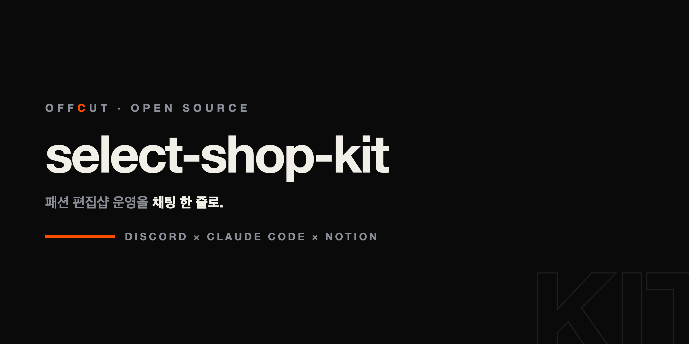

<div align="center">

# select-shop-kit

**패션 편집샵 운영을 채팅 한 줄로.**
Discord × Claude Code × Notion — 매출·재고·발주·정산·회의록 자동화 킷

[](LICENSE)
[](https://developers.notion.com)
[](https://claude.com/claude-code)

[가이드 사이트](https://select-shop-kit.vercel.app) · [설치](docs/setup.md) · [아키텍처](docs/architecture.md)



</div>

---

"오늘 매장에서 자켓 차콜 M 하나 카드로 팔림" 한 줄이면 — 매출 기록, 재고 차감, 원가 스냅샷, 마진 계산까지 끝납니다. 사입 쪽도 같은 원리로 돌아갑니다: 발주(PO)를 넣어두면 입고가 잡힐 때마다 미입고 잔액이 저절로 줄고, 미지급 사입금은 거래처별로 자동 집계되며, 아침마다 어느 발주가 며칠 지연인지·어떤 SKU가 재발주점을 쳤는지 브리핑이 옵니다. 3인 규모 스트릿 편집샵 운영을 기준으로 설계했고, 1인 샵도 그대로 쓸 수 있습니다.

## 사입(바잉)이 편해지는 지점

발주에서 정산까지, 사람이 대조하던 것을 전부 자동 대사로 돌립니다:

- **발주 넣고 잊기** — PO 행 하나에 발주총액·입고예정만 적으면, 입고(재고이동)가 연결될 때마다 **입고액·미입고 잔액이 자동 대사**됩니다. 부분입고도 상태만 바꾸면 끝
- **미지급이 스스로 집계** — 입고 행의 지급상태(미지급→지급완료)만 바꾸면 **거래처별 미지급금이 자동 합산**. 월말에 엑셀 대조 없음
- **재사입 단가가 과거를 안 건드림** — 원가는 판매 시점 스냅샷. 사입가를 올려도 지난달 마진이 소급 변경되지 않습니다
- **SKU별 재발주점** — 상품마다 재발주점을 정해두면(비우면 1) 그 이하로 떨어지는 순간 품절임박으로 자동 전환, 아침 브리핑에 잡힙니다
- **아침 브리핑 / 저녁 마감이 먼저 말 걸기** — cron 하나로 매일 발주 지연·재고 경고·미지급·정산 차이가 push 됩니다. 사람은 예외만 확인

## 무엇이 들어있나

| 구성 | 내용 |
|---|---|
| `setup/create_databases.py` | **Notion DB 13종 + 뷰 + 운영 대시보드를 한 번에 생성** — 브랜드/스타일(드롭)/상품(SKU)/재고이동/발주(PO)/매출/주문/정산/고객/거래처/일정/회의록 |
| `skills/sales` | 자연어 판매 입력 · 입고/폐기/실사 기록 · 자사몰 주문 CSV import (멱등키로 중복 방지) |
| `skills/meeting` | 회의 녹음 → 로컬 whisper 전사 → 회의록 + 액션아이템 자동 등록 (녹음이 외부로 안 나감) |
| `skills/shop-report` | 주간·월간 리포트 — 채널·브랜드별 순매출, 드롭 sell-through, 품절 임박, 정산 차이 알림. **`shop_brief.py` — cron 에 물리는 아침 브리핑·저녁 마감 생성기 (LLM 불필요)** |
| `skills/closeout` | 일일 마감 루틴 — 오늘 매출 + 미기록 확인 + 내일 일정 브리핑 |

## 왜 그냥 Notion 템플릿이 아닌가

장부 템플릿은 많지만, 이 킷은 **원장 규율**을 코드로 강제합니다:

- **append-only** — 반품은 음수 행, 교환은 2행. 과거 기록은 수정하지 않는다
- **원가 스냅샷** — 재사입으로 사입가가 바뀌어도 과거 판매의 마진이 소급 변경되지 않는다
- **멱등키** — 같은 Discord 메시지·같은 CSV를 두 번 처리해도 이중 기록이 생기지 않는다
- **자동 대사** — 발주 대비 입고액, 주문 헤더 대비 라인합계, 정산 실입금 차이가 전부 formula로 드러난다
- **재고 직접 수정 금지** — 실사 차이도 이력이 남는 "실사조정" 행으로

## 빠른 시작

```bash
git clone https://github.com/kinkos1234/select-shop-kit && cd select-shop-kit

# 1. Notion Integration 토큰 발급 후 (notion.so/my-integrations)
export NOTION_TOKEN=ntn_xxx

# 2. 허브 페이지에 Integration 연결 후, DB 13종 자동 생성
python3 setup/create_databases.py <parent_page_id> --staff "대표,직원A,직원B"

# 3. Claude Code 스킬 설치
./install.sh
```

상세 절차는 [docs/setup.md](docs/setup.md), 구조 설명은 [docs/architecture.md](docs/architecture.md).

## 이런 흐름이 됩니다

```
매장 (폰, Discord)                     Claude Code                Notion
"슬랙스 블랙 M 2장 현금"      →   상품 매칭·원가 스냅샷      →   매출 +1행, 재고 −2
"GRVTY 발주 94만원 25일 입고"  →   PO 생성                    →   입고 잡힐 때마다 잔액 자동 대사
회의녹음.m4a 첨부             →   로컬 whisper 전사·요약     →   회의록 + 액션아이템→일정
주문내역.csv 첨부             →   컬럼 자동 인식·중복 스킵    →   주문 헤더 + 라인 N행
"이번 달 정산해줘"            →   채널·브랜드별 집계          →   (리포트 회신 + 부가세 예상)

매일 08:47 (cron, 사람 입력 없음)
아침 브리핑 push  ←  오늘 일정 · 발주 지연 D+N · 품절임박(재발주점) · 미지급 · 정산 차이 · 어제 매출
매일 21:37 — 저녁 마감 push  ←  오늘 매출 · 재고 이상 · 내일 일정 · 미기록 확인 질문
```

## 한계

Notion을 원장으로 쓰는 구조라 **월 수백 건 규모까지**가 적정선입니다. 월 주문 300건 이상, 반품 월 10건 이상, 월말 대사에 2시간 이상 걸리기 시작하면 SQLite/Postgres 원장 + Notion 뷰 구조로 이전을 검토하세요 ([architecture.md](docs/architecture.md#한계-알고-쓰기)).

## 함께 쓰면 좋은 것

- [deck-factory](https://github.com/kimsh-1/deck-factory) — 시즌 룩북·IR 덱을 발표급 HTML로
- [@notionhq/notion-mcp-server](https://github.com/makenotion/notion-mcp-server) — Claude가 Notion을 직접 읽고 쓰게

## License

MIT — 상업적 사용, 수정, 재배포 자유.
